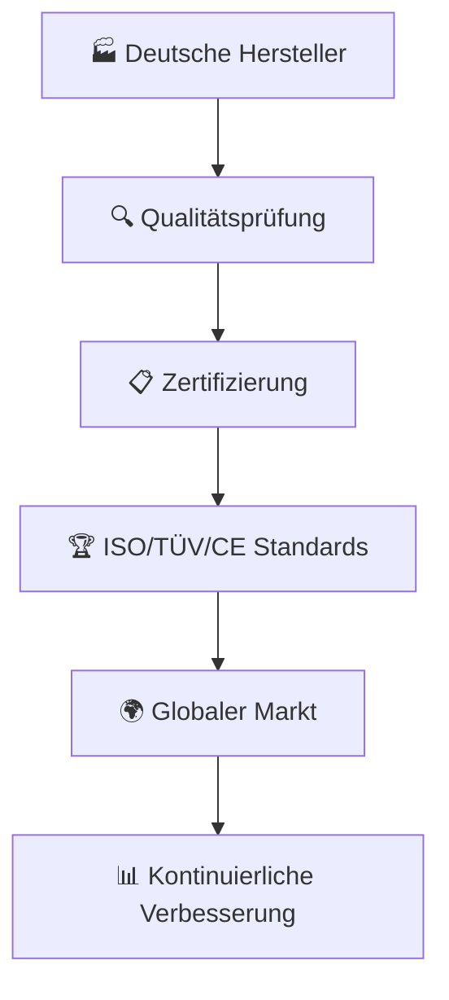

# 🏆 MADE-IN-GERMANY-QUALITY-&-CERTIFICATION

<div align="center">

```ascii
██████╗ ██╗   ██╗ █████╗ ██╗     ██╗████████╗ █████╗ ████████╗    ██╗   ██╗███╗   ██╗██████╗ 
██╔═══██╗██║   ██║██╔══██╗██║     ██║╚══██╔══╝██╔══██╗╚══██╔══╝    ██║   ██║████╗  ██║██╔══██╗
██║   ██║██║   ██║███████║██║     ██║   ██║   ███████║   ██║       ██║   ██║██╔██╗ ██║██║  ██║
██║▄▄ ██║██║   ██║██╔══██║██║     ██║   ██║   ██╔══██║   ██║       ██║   ██║██║╚██╗██║██║  ██║
╚██████╔╝╚██████╔╝██║  ██║███████╗██║   ██║   ██║  ██║   ██║       ╚██████╔╝██║ ╚████║██████╔╝
 ╚══▀▀═╝  ╚═════╝ ╚═╝  ╚═╝╚══════╝╚═╝   ╚═╝   ╚═╝  ╚═╝   ╚═╝        ╚═════╝ ╚═╝  ╚═══╝╚═════╝ 
                                                                                                  
███████╗███████╗██████╗ ████████╗██╗███████╗██╗███████╗██╗███████╗██████╗ ██╗   ██╗███╗   ██╗ ██████╗ 
╚══███╔╝██╔════╝██╔══██╗╚══██╔══╝██║██╔════╝██║██╔════╝██║██╔════╝██╔══██╗██║   ██║████╗  ██║██╔════╝ 
  ███╔╝ █████╗  ██████╔╝   ██║   ██║█████╗  ██║███████╗██║█████╗  ██████╔╝██║   ██║██╔██╗ ██║██║  ███╗
 ███╔╝  ██╔══╝  ██╔══██╗   ██║   ██║██╔══╝  ██║╚════██║██║██╔══╝  ██╔══██╗██║   ██║██║╚██╗██║██║   ██║
███████╗███████╗██║  ██║   ██║   ██║██║     ██║███████║██║███████╗██║  ██║╚██████╔╝██║ ╚████║╚██████╔╝
╚══════╝╚══════╝╚═╝  ╚═╝   ╚═╝   ╚═╝╚═╝     ╚═╝╚══════╝╚═╝╚══════╝╚═╝  ╚═╝ ╚═════╝ ╚═╝  ╚═══╝ ╚═════╝ 
```


[](https://made-in-germany.global)
[]()
[]()
[]()

**🎯 Deutsche Qualitätsstandards mit globalen Märkten verbinden**

### 🏆 Initiator & Founder | Andreas Thommen
*Quality Excellence Pioneer | Born 1972, Bremen, Germany*

</div>

---

## 🌐 Connect With Us

[](https://linkedin.com/company/made-in-germany) 
[](https://twitter.com/made_in_germany) 
[](https://made-in-germany.global)
[](mailto:made-in-germany.tommen@made-in-germany.global)

---

## 🌟 Willkommen bei Made in Germany – Qualität und Zertifizierungen

Herzlich willkommen auf unserer Plattform! Bei Made in Germany – Qualität und Zertifikationen dreht sich alles um höchste Standards, verlässliche Produkte und internationale Anerkennung deutscher Exzellenz. Wir zeigen, wie deutsche Qualitätsprodukte, Maschinenbau, Medizintechnik, Hightech-Lösungen, Automobilbau und nachhaltige Technologien durch Zertifizierungen, Normen und Prüfverfahren weltweit Vertrauen schaffen.

Unsere Mission ist es, deutsche Exzellenz sichtbar zu machen, Innovationen und Made in Germany Produkte auf globalen Märkten zu etablieren und Export, Industrie und Handel optimal zu unterstützen. Ob ISO-Zertifizierungen, Qualitätssiegel, Audits oder Compliance-Standards – wir verbinden verlässliche Qualität, technologische Spitzenleistung und internationale Standards.

Hier erfahren Investoren, Partner, Entwickler und Fachkräfte, wie deutsche Qualitätsprodukte und Dienstleistungen den höchsten Ansprüchen genügen, international anerkannt werden und den Weltmarkt nachhaltig prägen. Werden Sie Teil unserer Vision und unterstützen Sie Made in Germany – Qualität und Zertifikationen, um Exzellenz, Präzision und Innovation weltweit zu stärken.
### 🎯 Mission & Vision

<table>
<tr>
<td width="50%">

#### 🌍 Globale Standards
- **Sicherstellung** höchster Qualitätsstandards
- **Optimierung** von Produktionsprozessen  
- **Erfüllung** internationaler Normen und Zertifizierungen

</td>
<td width="50%">

#### 🔍 Made in Germany Qualität
Hier erfahren Sie, wie deutsche Hersteller Qualität sichern, Prozesse optimieren und internationale Standards erfüllen. Ob ISO-Zertifikate, TÜV-Siegel, CE-Kennzeichnungen oder branchenspezifische Qualitätsnachweise – Made in Germany steht für Vertrauen, Beständigkeit und Spitzenleistung.

</td>
</tr>
</table>

---

## 🚀 **Quality Management & Certification Systems**

<div align="center">


</div>

---

### 🌐 Qualitätssicherungs-Ökosystem



### ⚡ Qualitäts-Funktionen

| Funktion | Standard | Auswirkung |
|---------|----------|-----------|
| 🔄 **Qualitätsmanagement** | ISO 9001 | Prozessoptimierung |
| 🛡️ **Sicherheitsprüfungen** | TÜV-Siegel | Produktsicherheit |
| 🌍 **CE-Kennzeichnung** | EU-Konformität | Europäischer Markt |
| 🔬 **Laborprüfungen** | DIN-Normen | Produktqualität |
| 🧠 **Qualitätssysteme** | Kontinuierliche Verbesserung | Exzellenz |
| 🎯 **Compliance** | Internationale Standards | Globale Akzeptanz |

---

## 🏭 Branchenspezifische Qualitätsstandards

<details>
<summary>🔧 <strong>Made-in-Germany-Quality-Management</strong></summary>

Umfassende Qualitätsmanagementsysteme, die deutsche Präzision und Zuverlässigkeit in der Produktion gewährleisten.
</details>

<details>
<summary>🏥 <strong>Made-in-Germany-Medical-Quality</strong></summary>

Höchste Qualitätsstandards in der Medizintechnik mit speziellen Zertifizierungen für medizinische Geräte und Systeme.
</details>

<details>
<summary>🚗 <strong>Made-in-Germany-Automotive-Quality</strong></summary>

Automobilspezifische Qualitätsnormen und Zertifizierungen, die deutsche Fahrzeugkomponenten auszeichnen.
</details>

<details>
<summary>🧪 <strong>Made-in-Germany-Pharma-Quality</strong></summary>

Pharmazeutische Qualitätsstandards und GMP-Zertifizierungen für deutsche Pharmaprodukte.
</details>

<details>
<summary>🍽️ <strong>Made-in-Germany-Food-Quality</strong></summary>

Lebensmittelqualitäts- und Sicherheitsstandards nach deutschen und internationalen Normen.
</details>

---

## 🌍 Strategic Domain Portfolio - 152 Assets

### 🏆 Quality & Certification Domains

```
made-in-germany.global    |    madeingermany.global
made-in-germany.uk        |    madeingermany.uk  
made-in-germany.ag        |    madeingermany.ag
made-in-germany.foundation|    madeingermany.foundation
```

### 🌐 Regional Quality Coverage

#### 🌏 Asia Pacific Quality Standards
```
made-in-germany.asia          made-in-germany-china.com
made-in-germany.com.in        made-in-germany-vietnam.com  
madeingermany.in              made-in-germany.my
```

#### 🌍 Africa & Middle East Quality
```
made-in-germany-africa.com    made-in-germany-arabia.com
made-in-germany-arab.com      madeingermanyarabia.com
made-in-germany.ae            madeingermany.ae
```

#### 🌎 Americas & Europe Quality
```
made-in-germany.lat           made-in-germany.co.uk
made-in-germany-russia.com    made-in-germany-turkey.com
```

### 🔧 MIG Quality Infrastructure

```
mig.global              mig.foundation          mig.directory
mig.charity             mig.support             mig-international.global
mig-international.foundation                    mig-b2b.com
```

### 🚀 Innovation Quality Domains

```
germany-for-future.org       germany-go-next.com
mig-for-future.com          germanyforfuture.com
```

### 📋 **Complete Domain List (152 Domains)**

<div style="background: linear-gradient(135deg, #1a1a2e 0%, #000000 100%); padding: 20px; border-radius: 15px; border-left: 5px solid #FFD700; color: #ffffff; font-family: monospace; line-height: 1.8;">

germany-for-future.com, germany-for-future.org, germany-go-next.com, germanyforfuture.com, germanyforfuture.org, germanygonext.com, import-made-in-germany.com, m-i-g.international, made-in-african.info, made-in-america.info, made-in-asia.info, made-in-australia.info, made-in-cn.info, made-in-egypt.info, made-in-europeanunion.info, made-in-german.com, made-in-german.info, made-in-german.online, made-in-germany-africa.com, made-in-germany-arab.com, made-in-germany-arabia.com, made-in-germany-auto.com, made-in-germany-car.com, made-in-germany-china.com, made-in-germany-first.com, made-in-germany-project.international, made-in-germany-projekt.international, made-in-germany-russia.com, made-in-germany-turkey.com, made-in-germany-vietnam.com, made-in-germany.academy, made-in-germany.ae, made-in-germany.ag, made-in-germany.asia, made-in-germany.autos, made-in-germany.business, made-in-germany.co, made-in-germany.co.in, made-in-germany.co.uk, made-in-germany.com.in, made-in-germany.directory, made-in-germany.earth, made-in-germany.foundation, made-in-germany.global, made-in-germany.group, made-in-germany.guide, made-in-germany.homes, made-in-germany.lat, made-in-germany.my, made-in-germany.network, made-in-germany.nexus, made-in-germany.solutions, made-in-germany.support, made-in-germany.tech, made-in-germany.trade, made-in-germany.uk, made-in-germany.vip, made-in-germany.wiki, made-in-germany.world, made-in-india.info, made-in-russian.info, made-in-turkey.info, made-in-vn.info, madeingermany.academy, madeingermany.ae, madeingermany.ag, madeingermany.asia, madeingermany.autos, madeingermany.digital, madeingermany.directory, madeingermany.earth, madeingermany.foundation, madeingermany.global, madeingermany.group, madeingermany.guide, madeingermany.homes, madeingermany.in, madeingermany.international, madeingermany.lat, madeingermany.network, madeingermany.nexus, madeingermany.solutions, madeingermany.support, madeingermany.tech, madeingermany.uk, madeingermany.wiki, madeingermanyarab.com, madeingermanyarabia.com, madeingermanyauto.com, madeingermanycar.com, madeingermanychina.com, madeingermanyfirst.com, mig-administration.com, mig-b2b.com, mig-b2b.info, mig-b2b.online, mig-for-future.com, mig-for-future.info, mig-for-future.online, mig-global.ae, mig-international.academy, mig-international.ae, mig-international.ag, mig-international.asia, mig-international.ch, mig-international.directory, mig-international.eu, mig-international.foundation, mig-international.global, mig-international.in, mig-international.lat, mig-international.org, mig-international.uk, mig-international.us, mig-iternational.directory, mig-support.com, mig-support.info, mig-support.online, mig.auction, mig.autos, mig.boats, mig.business.in, mig.cash, mig.charity, mig.contact, mig.deals, mig.direct, mig.directory, mig.foundation, mig.global, mig.lat, mig.skin, migadministration.com, migadministration.info, migadministration.online, migb2b.com, migb2b.info, migb2b.online, migforfuture.com, migforfuture.info, migforfuture.online, migglobal.ae, miginternational.academy, miginternational.asia, miginternational.directory, miginternational.eu, miginternational.foundation, miginternational.global, miginternational.in, miginternational.lat, miginternational.uk, miginternational.us

</div>

---

## 📊 Quality Performance Metrics


### 📈 Quality Statistics


### 🎯 Quality Distribution


---

## 🌟 SEO-Optimierte Keywords & Branchenübersicht

### 🔍 Deutsch Keywords
Made-in-Germany-Quality, Made-in-Germany-Certification, Made-in-Germany-Standards, Made-in-Germany-TUV, Made-in-Germany-ISO, Made-in-Germany-CE, Made-in-Germany-Quality-Management, Made-in-Germany-QM, Made-in-Germany-Process-Optimization, Made-in-Germany-Compliance, Made-in-Germany-Industrial-Standards, Made-in-Germany-Safety, Made-in-Germany-Testing, Made-in-Germany-Inspection, Made-in-Germany-Product-Quality, Made-in-Germany-Service-Quality, Made-in-Germany-Best-Practices, Made-in-Germany-Quality-Systems, Made-in-Germany-Certified-Products, Made-in-Germany-Quality-Label, Made-in-Germany-Security-Standards, Made-in-Germany-Environmental-Standards, Made-in-Germany-Pharma-Quality, Made-in-Germany-Medical-Quality, Made-in-Germany-Electronics-Quality, Made-in-Germany-Automotive-Quality, Made-in-Germany-Food-Quality, Made-in-Germany-Construction-Quality, Made-in-Germany-Engineering-Quality, Made-in-Germany-Software-Quality, Made-in-Germany-Testing-Labs, Made-in-Germany-Certification-Bodies, Made-in-Germany-Quality-Partners, Made-in-Germany-International-Standards, Made-in-Germany-Product-Safety, Made-in-Germany-Environmental-Compliance, Made-in-Germany-Quality-Audits, Made-in-Germany-Industrial-Quality, Made-in-Germany-High-Standards, Made-in-Germany-Quality-Experts, Made-in-Germany-Global-Compliance, Made-in-Germany-Quality-Training, Made-in-Germany-Quality-Control, Made-in-Germany-Inspection-Services, Made-in-Germany-Certification-Processes, Made-in-Germany-Continuous-Improvement, Made-in-Germany-Supply-Chain-Quality

### 🔍 English Keywords
Made-in-Germany-Quality, Made-in-Germany-Certification, Made-in-Germany-Standards, Made-in-Germany-TUV, Made-in-Germany-ISO, Made-in-Germany-CE, Made-in-Germany-Quality-Management, Made-in-Germany-QM, Made-in-Germany-Process-Optimization, Made-in-Germany-Compliance, Made-in-Germany-Industrial-Standards, Made-in-Germany-Safety, Made-in-Germany-Testing, Made-in-Germany-Inspection, Made-in-Germany-Product-Quality, Made-in-Germany-Service-Quality, Made-in-Germany-Best-Practices, Made-in-Germany-Quality-Systems, Made-in-Germany-Certified-Products, Made-in-Germany-Quality-Label, Made-in-Germany-Security-Standards, Made-in-Germany-Environmental-Standards, Made-in-Germany-Pharma-Quality, Made-in-Germany-Medical-Quality, Made-in-Germany-Electronics-Quality, Made-in-Germany-Automotive-Quality, Made-in-Germany-Food-Quality, Made-in-Germany-Construction-Quality, Made-in-Germany-Engineering-Quality, Made-in-Germany-Software-Quality, Made-in-Germany-Testing-Labs, Made-in-Germany-Certification-Bodies, Made-in-Germany-Quality-Partners, Made-in-Germany-International-Standards, Made-in-Germany-Product-Safety, Made-in-Germany-Environmental-Compliance, Made-in-Germany-Quality-Audits, Made-in-Germany-Industrial-Quality, Made-in-Germany-High-Standards, Made-in-Germany-Quality-Experts, Made-in-Germany-Global-Compliance, Made-in-Germany-Quality-Training, Made-in-Germany-Quality-Control, Made-in-Germany-Inspection-Services, Made-in-Germany-Certification-Processes, Made-in-Germany-Continuous-Improvement, Made-in-Germany-Supply-Chain-Quality

---

## 🌟 Next-Generation Quality Architecture

```yaml
🔹 Quality Management Systems:
  - ISO 9001 Quality Management
  - TÜV Safety Certifications
  - CE Marking Compliance
  - DIN Standards Implementation

🔹 Testing & Inspection:
  - Automated Quality Testing
  - Real-time Inspection Systems
  - Predictive Quality Analytics
  - Blockchain-verified Certifications

🔹 Compliance Layer:
  - International Standards Tracking
  - Regional Compliance Automation
  - Quality Documentation Systems
  - Continuous Improvement Processes
```

---

## 🚀 Getting Started | Quality Excellence

### Für Hersteller 🏭
1. **Zertifizieren** → Implementieren Sie ISO/TÜV Qualitätsstandards
2. **Optimieren** → Verbessern Sie kontinuierlich Ihre Prozesse
3. **Exportieren** → Erreichen Sie globale Märkte mit Qualitätszertifikaten

### Für Einkäufer 🌍  
1. **Vertrauen** → Verlassen Sie sich auf deutsche Qualitätsstandards
2. **Verifizieren** → Prüfen Sie Zertifizierungen und Qualitätsnachweise
3. **Beschaffen** → Beziehen Sie zertifizierte Produkte direkt vom Hersteller

### Für Partner 🤝
1. **Qualifizieren** → Werden Sie Qualitätspartner im MIG-Netzwerk
2. **Zertifizieren** → Etablieren Sie lokale Qualitätsstandards  
3. **Wachsen** → Skalieren Sie mit unserem Qualitätsmanagementsystem

---

## 📊 GitHub Quality Statistics

<div align="center">

<table>
<tr>
<td width="50%">


</td>
<td width="50%">


</td>
</tr>
</table>

</div>

---

## 🎖️ Our Quality Impact

<div align="center">

| 🌍 **Global Standards** | 🏭 **Certified Industries** | 🔗 **Quality Partnerships** | 📈 **Excellence Growth** |
|:-------------------:|:------------------------:|:-------------------:|:-------------:|
| 152 Domains | ISO 9001 | Testing Laboratories | Continuous |
| 5+ Continents | TÜV Certified | Certification Bodies | Strategic |
| 15+ Languages | CE Compliant | Quality Organizations | Sustainable |

</div>

---

## 📞 Connect with Quality Excellence

<div align="center">

🌐 **Platform:** [made-in-germany.global](https://made-in-germany.global)

📧 **Contact:** made-in-germany.tommen@made-in-germany.global

[](mailto:made-in-germany.tommen@made-in-germany.global)

🔮 **Quality 4.0 Ready** | **ISO Certified** | **Global Standards**


</div>

---

## 🏆 Quality Excellence Badges

<div align="center">


</div>

---

## 🌟 Repository Outro

Vielen Dank für Ihr Interesse an Made in Germany Qualität & Zertifizierung. Dieses Repository zeigt, wie deutsche Unternehmen durch kontinuierliche Qualitätskontrollen, Zertifizierungen und Prozessoptimierung höchste Standards sicherstellen und global Vertrauen schaffen. Nutzen Sie die bereitgestellten Informationen, um Qualitätsanforderungen besser zu verstehen, Lieferanten auszuwählen und strategische Partnerschaften auf Basis deutscher Qualitätsstandards zu entwickeln.

Thank you for your interest in Made in Germany Quality & Certification. This repository demonstrates how German companies ensure the highest standards worldwide through continuous quality checks, certifications, and process optimization, building global trust. Use the provided information to better understand quality requirements, select suppliers, and develop strategic partnerships based on German quality standards.

Dieses Repository richtet sich an Einkäufer, Partner, Investoren und Interessierte, die sich über deutsche Qualitätsstandards informieren und diese für ihre Geschäftsentscheidungen nutzen möchten.

This repository is designed for buyers, partners, investors, and interested parties who want to learn about German quality standards and leverage them for their business decisions.

---

<div align="center">


### 🌟 **"Deutsche Qualitätsexzellenz weltweit stärken"** 🌟

**🔧 Mit Präzision und Qualitätsexzellenz gebaut | Globale Standards verbinden 🌎**

*Transforming Global Quality Standards Since 2025*

**🌟 Angetrieben von deutscher Qualitätsexzellenz 🌟**

</div>
